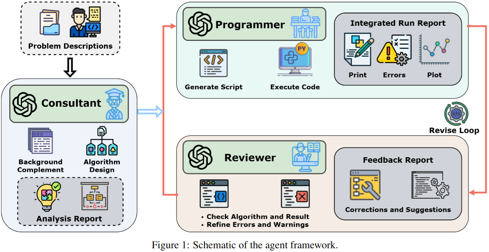

# Re4-Scientific-Computing-Agent
### Rewriting · Resolution · Review · Revision



The proposed agent incorporates a **"Rewriting-Resolution-Review-Revision"** logical chain via three reasoning LLMs (functioning as the Consultant, Reviewer, and Programmer) to solve complex scientific computing problems in a collaborative and interactive manner.

## 🚀 Key Features & Roadmap
- **LangGraph Orchestra**: Orchestrates multi-task, multi-step agent workflows, ensuring scalability and maintainability.

- **Structured Output**: Generates standardized, parsable formats (via Pydantic) to ensure consistency and reusability of intermediate results.

- **Context Management**: Utilizes a shared state graph to manage solution plans, code history, and review feedback across multi-turn agent interactions, improving the coherence of interactions.

- **Multimodal Review**: Enables the Reviewer agent to validate not just code logic but also visual outputs (plots, contours), achieving comprehensive quality control.

- [ ] **Interactive Frontend**: Develop a Streamlit-based UI for easier user interaction (In Progress).

## 📂 Project Structure
```
src/
├── ipynb_ver     # code in Jupyter Notebook (.ipynb) format
└── pycodes_ver   # code packaged as Python scripts (.py) format
```

## 📧 Contact
This work is presented at the **ICLR 2026 Workshop on AI and Partial Differential Equations (AI&PDE)** [](https://openreview.net/forum?id=PMdr3fQpBE).

If you find this repository useful, please consider giving a star ⭐ and cite our conference Workshop paper.

```
@inproceedings{cheng2026re,
  title={Re4: Scientific Computing Agent with Rewriting, Resolution, Review and Revision},
  author={Ao Cheng and Lei Zhang and Guowei He},
  booktitle={AI&PDE: ICLR 2026 Workshop on AI and Partial Differential Equations},
  year={2026},
  url={https://openreview.net/forum?id=PMdr3fQpBE}
}
```
