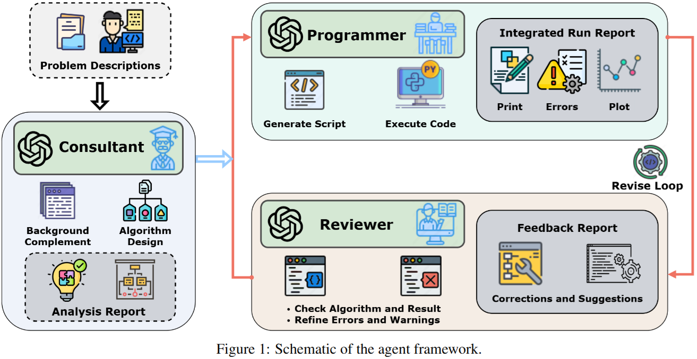

# Re4-Scientific-Computing-Agent
### Rewriting · Resolution · Review · Revision



The proposed agent incorporates a **"Rewriting-Resolution-Review-Revision"** logical chain via three reasoning LLMs (functioning as the Consultant, Reviewer, and Programmer) to solve complex scientific computing problems in a collaborative and interactive manner.

For more details, see our arXiv preprint [](https://arxiv.org/abs/2305.01582)

## 🚀 Key Features & Roadmap
- **LangGraph Orchestra**: Orchestrates multi-task, multi-step agent workflows, ensuring scalability and maintainability.
- 
- **Structured Output**: Generates standardized, parsable formats (via Pydantic) to ensure consistency and reusability of intermediate results.
- 
- **Context Management**: Utilizes a shared state graph to manage solution plans, code history, and review feedback across multi-turn agent interactions, improving the coherence of interactions.
- **Multimodal Review**: Enables the Reviewer agent to validate not just code logic but also visual outputs (plots, contours), achieving comprehensive quality control.
- [ ] **Interactive Frontend**: Develop a Streamlit-based UI for easier user interaction (In Progress).

## 📂 Project Structure
```
src/
├── ipynb_ver     # code in Jupyter Notebook (.ipynb) format
└── pycodes_ver   # code packaged as Python scripts (.py) format
```

## 📧 Contact
If you have any questions on our work or implementation, feel free to reach out to [chengao23@mails.ucas.ac.cn](mailto:chengao23@mails.ucas.ac.cn)!

If you find this repository useful, please consider giving a star ⭐ and cite our paper.

```
@article{cheng2025re4,
  title={Re4: Scientific Computing Agent with Rewriting, Resolution, Review and Revision},
  author={Cheng, Ao and Zhang, Lei and He, Guowei},
  journal={arXiv preprint arXiv:2508.20729},
  year={2025}
}
```
